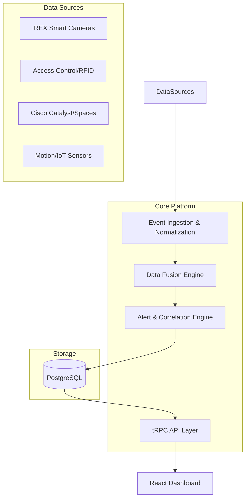

# Brown University ELI Platform (Emergency Location Intelligence)

Next-generation campus security monitoring platform designed for Brown University. This platform integrates multiple security data sources to provide real-time situational awareness and proactive threat detection.

## 🚀 Overview

The Brown ELI platform is a unified situational awareness layer that fuses real-time video, sensors, and operational data. Built in response to modern campus security challenges, it transforms passive surveillance into proactive incident response.

### Key Capabilities
- **Real-Time Location Tracking**: 2D floor plan visualization of personnel and assets using data fusion (Wi-Fi, RFID, Facial Recognition).
- **Intelligent Video Analytics**: Monitoring of 800+ cameras with AI-powered threat detection (weapons, person-down, anomalous crowds).
- **Unified Alerting**: Prioritized alert feed with AI confidence scores and cross-system correlation.
- **Incident Management**: Collaborative workspaces for coordinated response with automated timelines and evidence binding.
- **Privacy by Design**: Role-based access control, anonymized data options, and comprehensive audit logging.

## 🛠️ Architecture

The platform follows a modern micro-services-inspired architecture:

- **Frontend**: React (Vite) with Tailwind CSS, Framer Motion, and tRPC.
- **Backend**: Node.js (Express) with tRPC for typesafe API communication.
- **Database**: PostgreSQL (Neon) with Drizzle ORM.
- **Data Fusion**: Canonical event model for ingesting and normalizing disparate sensor data.



## 💻 Local Development

### Prerequisites
- Node.js (v18+)
- pnpm

### Setup
1. Clone the repository
2. Install dependencies:
   ```bash
   pnpm install
   ```
3. Set up environment variables (copy `.env.example` to `.env`):
   ```bash
   # Database
   DATABASE_URL=postgresql://...
   
   # Auth
   JWT_SECRET=your-secret-key
   ```
4. Push database schema:
   ```bash
   pnpm db:push
   ```
5. Seed the database (optional for demo):
   ```bash
   pnpm tsx server/seed.ts
   ```
6. Start the development server:
   ```bash
   pnpm dev
   ```

## 🌐 Deployment (Vercel)

The platform is optimized for Vercel Serverless deployment.

### Vercel Project Settings
To ensure the correct version of `pnpm` is used, you MUST set the following environment variable in your Vercel project settings:
- **`ENABLE_COREPACK`**: `1` (This enables `corepack` to use the version specified in `package.json`).

### Required Environment Variables
| Variable | Description |
|----------|-------------|
| `DATABASE_URL` | Connection string for Neon PostgreSQL |
| `JWT_SECRET` | Secret key for JWT session signing |
| `NODE_ENV` | Set to `production` |

## 🧪 Demo Access
Access the platform using the following credentials:
- **Username**: `admin`
- **Password**: `admin`

## 📄 Documentation
Detailed design documents and requirements can be found in the `docs/` folder.
- [Design Suggestions](docs/bown_design_suggestions_gpt.txt)
- [Original Requirements](docs/brown_origional_prompt.txt)

